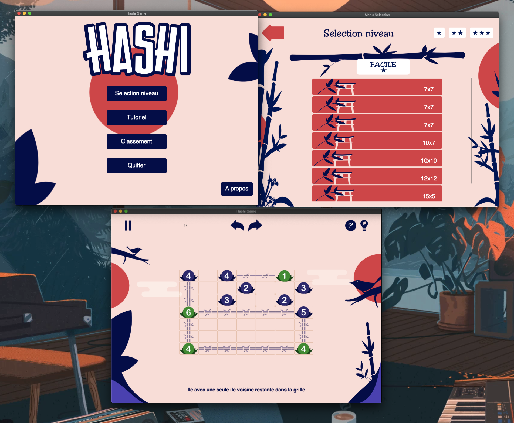

# Hashi-TP4

Projet développé dans le cadre du module de Génie Logiciel de 3ème année de Licence Informatique (Le Mans Université). 
Le but était de concevoir une application permettant la résolution et l'aide à la résolution de puzzles de type Hashiwokakero.

L'équipe à l'origine de ce projet était composé de 9 personnes.

### Lien du github d'origine
https://github.com/Nowyyy/Hashi-TP4

### Règles du jeu
Le Hashiwokakero se joue sur une grille rectangulaire sans grandeur standard. On y retrouve des nombres de 1 à 8 inclusivement. Ils sont généralement encerclés et nommés îles. Le but du jeu est de relier toutes les îles en un seul groupe en créant une série de ponts entre les îles.

Tout pont débute et finit sur une île.
Deux îles ne peuvent pas être reliées par plus de deux ponts.
Aucun pont ne peut en croiser un autre.
Tous les ponts sont en ligne droite, à l'horizontale ou à la verticale.
Le nombre de ponts qui passent sur une île est le nombre indiqué sur l'île.
Toutes les îles doivent être reliées entre elles.

### Technologies utilisées :
- Ruby
- GTK3
- Glade

## NB 💗

En complément de mon rôle de développeuse sur le projet, j'ai également pris en charge la conception de l'identité visuelle du jeu ( icône, éléments graphiques, logo, etc.).
